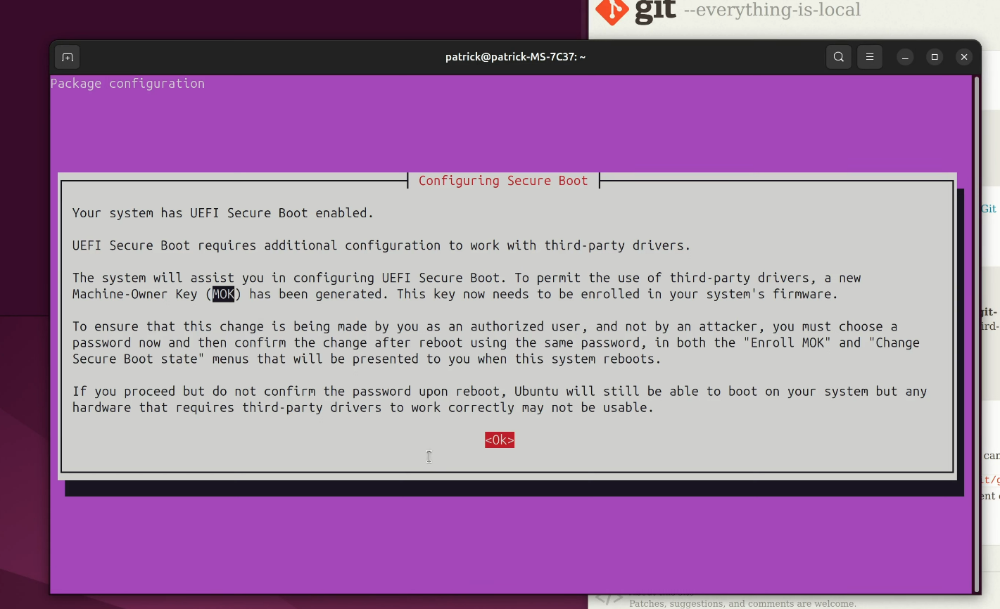
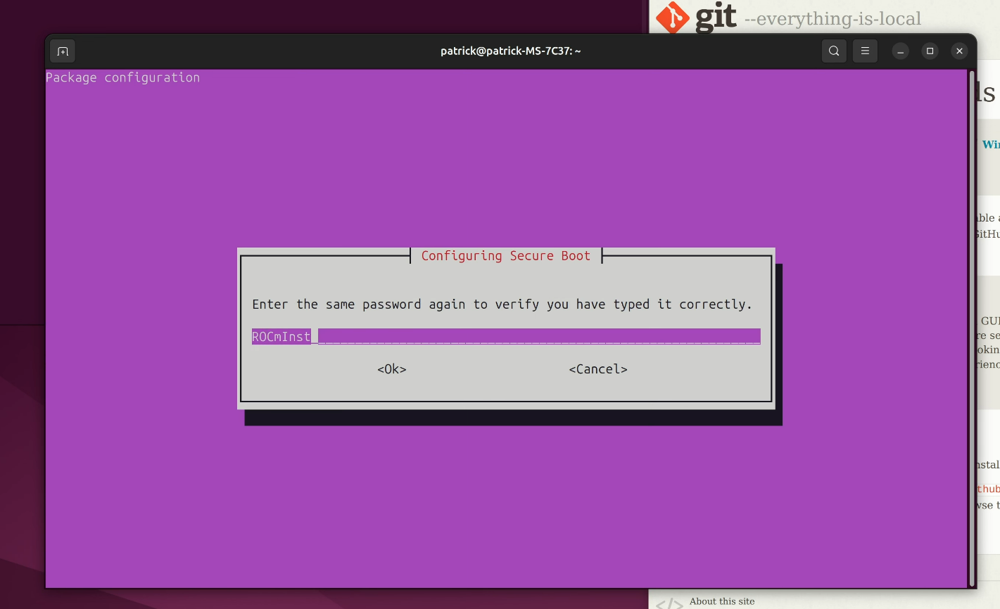
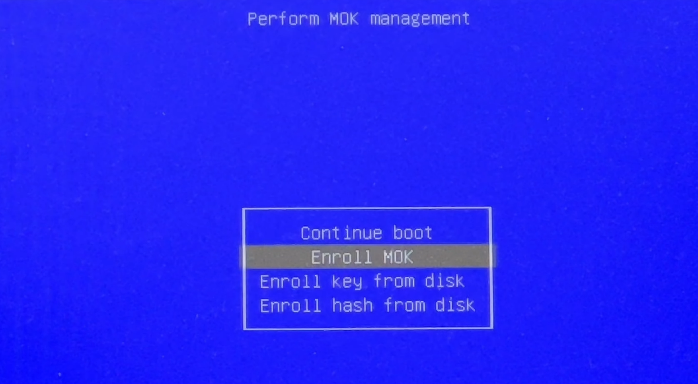
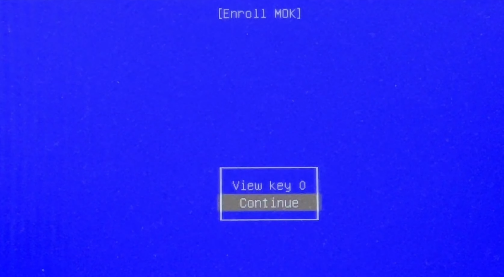
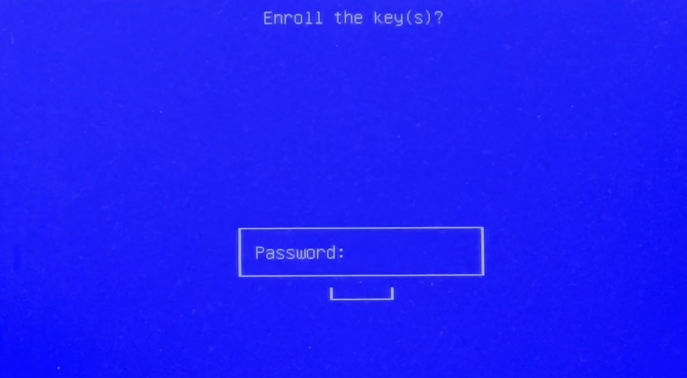

# linux-rocm-guide

## How to install ROCm

Execute the follow in terminal:

```bash
sudo apt update
sudo apt install "linux-headers-$(uname -r)" "linux-modules-extra-$(uname -r)"
sudo apt install python3-setuptools python3-wheel
sudo usermod -a -G render,video $LOGNAME # Add the current user to the render and video groups
wget https://repo.radeon.com/amdgpu-install/6.3.3/ubuntu/noble/amdgpu-install_6.3.60303-1_all.deb
sudo apt install ./amdgpu-install_6.3.60303-1_all.deb
sudo apt update
sudo apt install amdgpu-dkms rocm
```



Set a password:



Execute the following:

```bash
sudo usermod -aG video $USER
sudo usermod -aG render $USER
```

After this, just reboot.

```bash
sudo reboot
```





Put the password we setted a few moments before ad reboot..



Check the installation with:

```bash
rocminfo | grep gfx
```

[Complete video here](https://www.youtube.com/watch?v=NhGtBL4fi0c)

## How to install Pytorch

https://www.youtube.com/watch?v=U_iywNpp1L8

### Create environment

I recommend to create environment inside the proyect/repo and ignore the folder using .gitignore.

```bash
python3 -m venv [name]
```

### Install inside environment

```bash
source tf-rocm-env/bin/activate

wget https://repo.radeon.com/rocm/manylinux/rocm-rel-6.3.4/torch-2.4.0%2Brocm6.3.4.git7cecbf6d-cp312-cp312-linux_x86_64.whl
wget https://repo.radeon.com/rocm/manylinux/rocm-rel-6.3.4/torchvision-0.19.0%2Brocm6.3.4.gitfab84886-cp312-cp312-linux_x86_64.whl
wget https://repo.radeon.com/rocm/manylinux/rocm-rel-6.3.4/pytorch_triton_rocm-3.0.0%2Brocm6.3.4.git75cc27c2-cp312-cp312-linux_x86_64.whl
wget https://repo.radeon.com/rocm/manylinux/rocm-rel-6.3.4/torchaudio-2.4.0%2Brocm6.3.4.git69d40773-cp312-cp312-linux_x86_64.whl
pip3 uninstall torch torchvision pytorch-triton-rocm
pip3 install torch-2.4.0+rocm6.3.4.git7cecbf6d-cp312-cp312-linux_x86_64.whl torchvision-0.19.0+rocm6.3.4.gitfab84886-cp312-cp312-linux_x86_64.whl torchaudio-2.4.0+rocm6.3.4.git69d40773-cp312-cp312-linux_x86_64.whl pytorch_triton_rocm-3.0.0+rocm6.3.4.git75cc27c2-cp312-cp312-linux_x86_64.whl
python3 -c 'import torch' 2> /dev/null && echo 'Success' || echo 'Failure'
```

More information here:

[AMD ROCm Pytorch](https://rocm.docs.amd.com/projects/install-on-linux/en/latest/install/3rd-party/pytorch-install.html)

## How to install TensorFlow

### Install inside environment

Check at first the ROCm version installed.

```bash
cat /opt/rocm/.info/version
```

Depending of the ROCm version, select the tensorflow package. More information here:

[AMD ROCm TensorFlow Installation Guide](https://rocm.docs.amd.com/projects/install-on-linux/en/latest/install/3rd-party/tensorflow-install.html#install-tensorflow-versions)


```bash
source tf-rocm-env/bin/activate

pip3 install tensorflow-rocm==2.16.2 -f https://repo.radeon.com/rocm/manylinux/rocm-rel-6.3.3/ --upgrade
python3 -c 'import tensorflow' 2> /dev/null && echo ‘Success’ || echo ‘Failure’
```